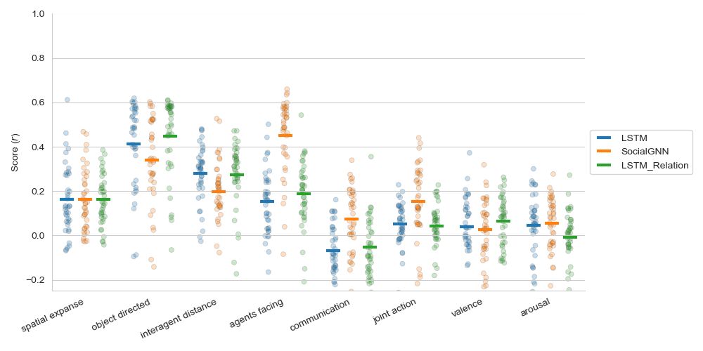
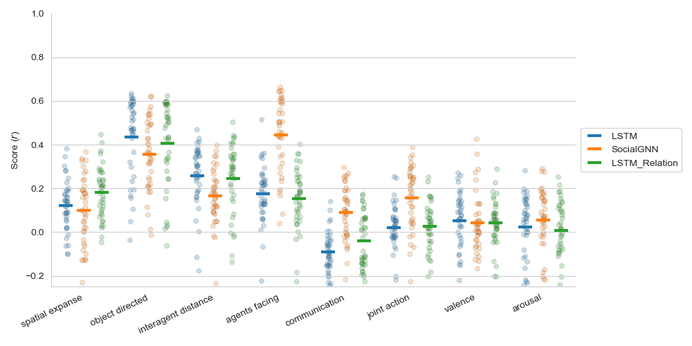

# SocialGNN Encoding Results

## Figures Overview

The figures are stored in the `result_figures/behavioral_encoding` directory and represent the final states (the last 
hidden layer) of different models tested. 

Ridge regression is performed using RidgeCV, which automatically selects the best regularization strength 
(alpha) from seven values sampled from a logspace of 10e-2, 10e5. Performance was measured as the Pearson correlation between the predicted behavioral or neural response and the true
response

### Ridge regression behavioral encoding results

### Linear regression behavioral encoding results

