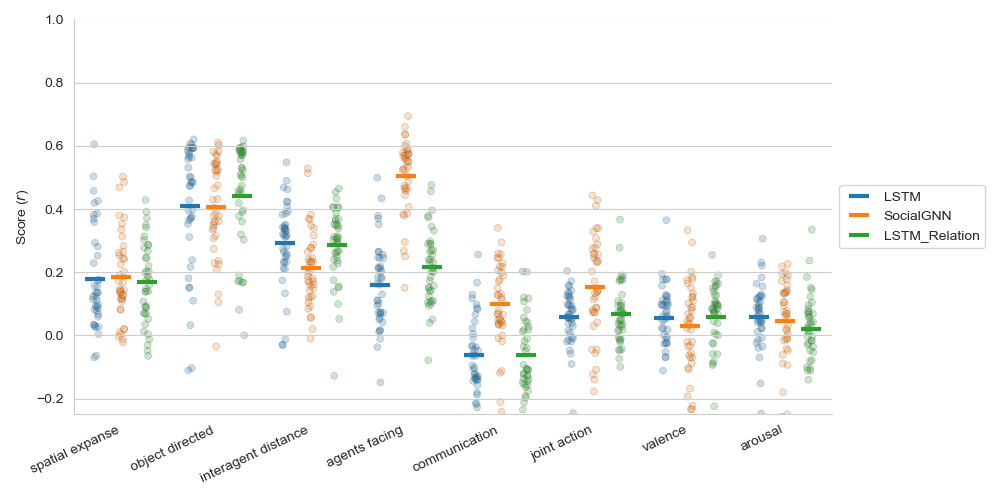
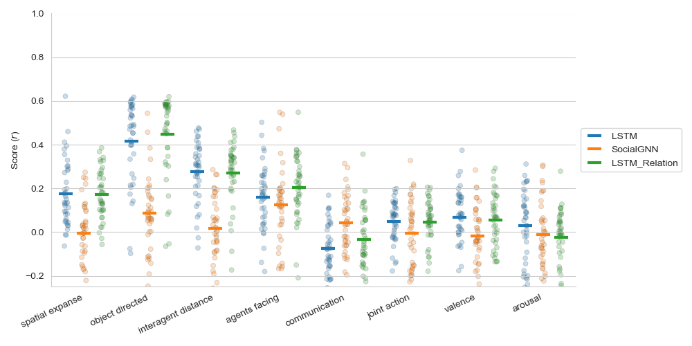

# SocialGNN Encoding Results

## Figures Overview

The figures are stored in the `result_figures/behavioral_encoding` directory and represent the different layers of different models tested. 

The following reproduce the methods in Garcia & McMahon et al:

Before fitting the linear mapping, we first z-scored the model-SRP feature space across the samples
independently for each feature in the 200-video train set defined in the original dataset [15] and then
normalized the held-out data from 50 videos by the mean and standard deviation from the train set.
We normalized the behavioral and neural data using the same procedure

Train (200) and test (50) data are predefined. Ridge regression is performed using RidgeCV, which automatically selects the best regularization strength 
(alpha) from seven values sampled from a logspace of 10e-2, 10e5. Performance was measured as the Pearson correlation between the predicted behavioral or neural response and the true
respons. 

Garcia, McMahon, et al. "Modeling dynamic social vision highlights gaps between deep learning and humans." (2024).

### Ridge regression behavioral encoding 

model tested: 
* LSTM, final_state
* SocialGNN, final_state
* LSTM_Relation, final_state

model tested: 
* LSTM, final_state
* SocialGNN, RNN_output
* LSTM_Relation, final_state

### Linear regression behavioral encoding results

model tested: 
* LSTM, final_state
* SocialGNN, final_state
* LSTM_Relation, final_state

model tested: 
* LSTM, final_state
* SocialGNN, RNN_output
* LSTM_Relation, final_state

