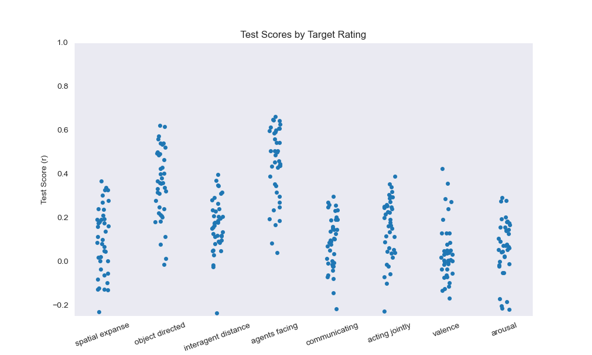
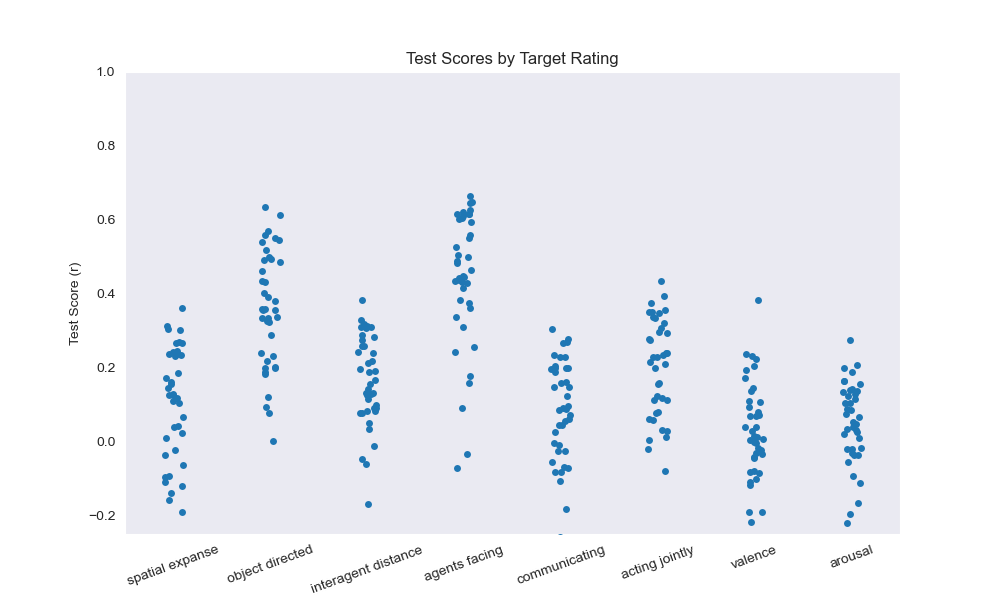
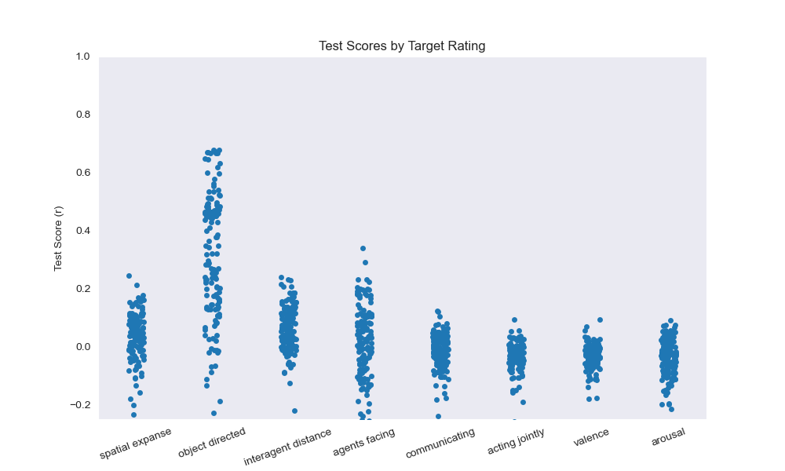
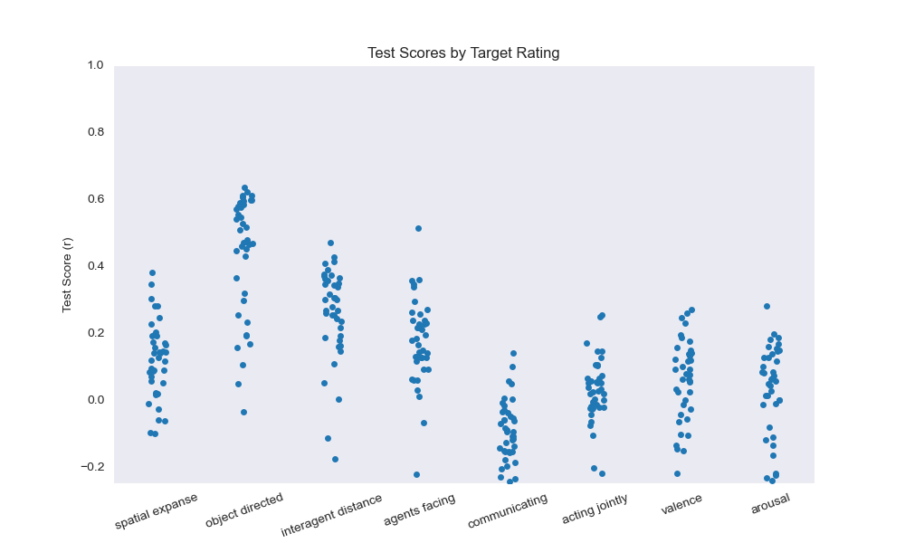
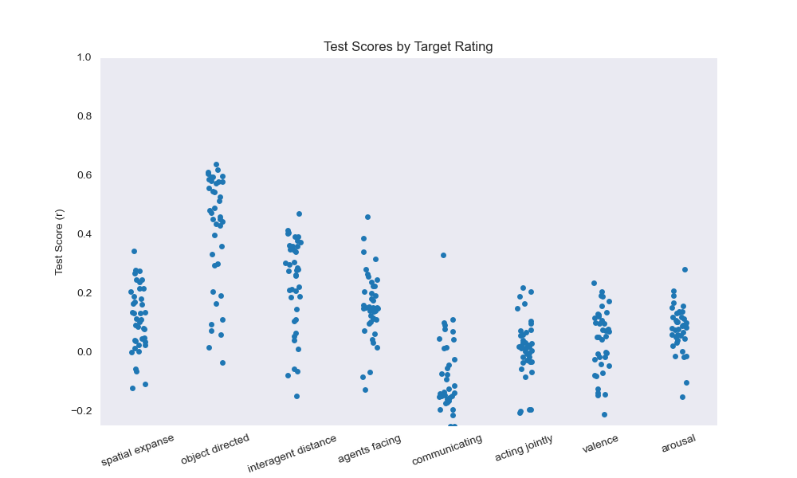

# SocialGNN Encoding Results

## Figures Overview

The figures are stored in the `result_figures/behavioral_encoding` directory and represent the final states (the last 
hidden layer) of different models tested. 

Ridge regression is performed using RidgeCV, which automatically selects the best regularization strength 
(alpha) from 10^(-5), 10^-4， 10^-3, 10^-2, 10^-1, 10. RidgeCV used a 4-Fold cross-validation to creat 4 split of training and testing sets
### 1. SocialGNN Linear & Ridge Regression

    
    

### 2. LSTM Relation Linear & Ridge Regression

    
    

### 3. LSTM Linear & Ridge Regression

    
    

