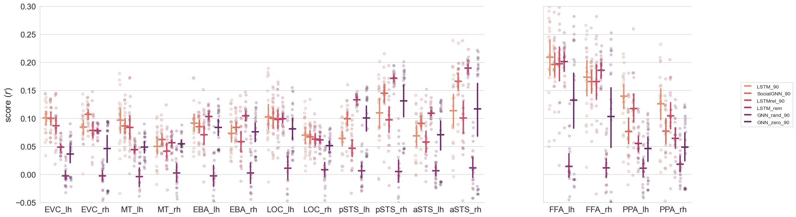

# SocialGNN Encoding Results

## Figures Overview

You can check out more figures in the `result_figures` directory.

Layer representations are from the last hidden layer(final_state) of each model

[//]: # (The following reproduce the methods in Garcia & McMahon et al:)

[//]: # ()
[//]: # (Before fitting the linear mapping, we first z-scored the model-SRP feature space across the samples)

[//]: # (independently for each feature in the 200-video train set defined in the original dataset [15] and then)

[//]: # (normalized the held-out data from 50 videos by the mean and standard deviation from the train set.)

[//]: # (We normalized the behavioral and neural data using the same procedure)

[//]: # ()
[//]: # (Train &#40;200&#41; and test &#40;50&#41; data are predefined. Ridge regression is performed using RidgeCV, which automatically selects the best regularization strength )

[//]: # (&#40;alpha&#41; from seven values sampled from a logspace of 10e-2, 10e5. Performance was measured as the Pearson correlation between the predicted behavioral or neural response and the true)

[//]: # (respons. )

[//]: # ()
[//]: # (Garcia, McMahon, et al. "Modeling dynamic social vision highlights gaps between deep learning and humans." &#40;2024&#41;.)

### Linear Regression Behavioral Encoding

#### PC90

#### PC20

### Ridge Regression Neural Encoding 
#### PC90

#### PC20
